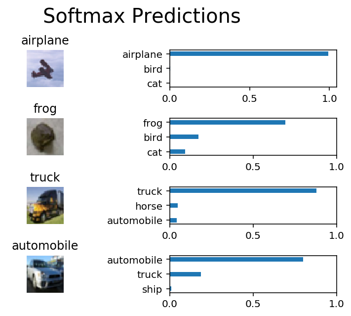

# Image Classification
In this project, you'll classify images from the [CIFAR-10 dataset](https://www.cs.toronto.edu/~kriz/cifar.html).  The dataset consists of airplanes, dogs, cats, and other objects. You'll preprocess the images, then train a convolutional neural network on all the samples. The images need to be normalized and the labels need to be one-hot encoded.  You'll get to apply what you learned and build a convolutional, max pooling, dropout, and fully connected layers.  At the end, you'll get to see your neural network's predictions on the sample images.
## Get the Data
Run the following cell to download the [CIFAR-10 dataset for python](https://www.cs.toronto.edu/~kriz/cifar-10-python.tar.gz).


```python
"""
DON'T MODIFY ANYTHING IN THIS CELL THAT IS BELOW THIS LINE
"""
from urllib.request import urlretrieve
from os.path import isfile, isdir
from tqdm import tqdm
import problem_unittests as tests
import tarfile

cifar10_dataset_folder_path = 'cifar-10-batches-py'

# Use Floyd's cifar-10 dataset if present
floyd_cifar10_location = '/input/cifar-10/python.tar.gz'
if isfile(floyd_cifar10_location):
    tar_gz_path = floyd_cifar10_location
else:
    tar_gz_path = 'cifar-10-python.tar.gz'

class DLProgress(tqdm):
    last_block = 0

    def hook(self, block_num=1, block_size=1, total_size=None):
        self.total = total_size
        self.update((block_num - self.last_block) * block_size)
        self.last_block = block_num

if not isfile(tar_gz_path):
    with DLProgress(unit='B', unit_scale=True, miniters=1, desc='CIFAR-10 Dataset') as pbar:
        urlretrieve(
            'https://www.cs.toronto.edu/~kriz/cifar-10-python.tar.gz',
            tar_gz_path,
            pbar.hook)

if not isdir(cifar10_dataset_folder_path):
    with tarfile.open(tar_gz_path) as tar:
        tar.extractall()
        tar.close()


tests.test_folder_path(cifar10_dataset_folder_path)
```

    All files found!


## Explore the Data
The dataset is broken into batches to prevent your machine from running out of memory.  The CIFAR-10 dataset consists of 5 batches, named `data_batch_1`, `data_batch_2`, etc.. Each batch contains the labels and images that are one of the following:
* airplane
* automobile
* bird
* cat
* deer
* dog
* frog
* horse
* ship
* truck

Understanding a dataset is part of making predictions on the data.  Play around with the code cell below by changing the `batch_id` and `sample_id`. The `batch_id` is the id for a batch (1-5). The `sample_id` is the id for a image and label pair in the batch.

Ask yourself "What are all possible labels?", "What is the range of values for the image data?", "Are the labels in order or random?".  Answers to questions like these will help you preprocess the data and end up with better predictions.


```python
%matplotlib inline
%config InlineBackend.figure_format = 'retina'

import helper
import numpy as np

# Explore the dataset
batch_id = 1
sample_id = 5
helper.display_stats(cifar10_dataset_folder_path, batch_id, sample_id)
```

    
    Stats of batch 1:
    Samples: 10000
    Label Counts: {0: 1005, 1: 974, 2: 1032, 3: 1016, 4: 999, 5: 937, 6: 1030, 7: 1001, 8: 1025, 9: 981}
    First 20 Labels: [6, 9, 9, 4, 1, 1, 2, 7, 8, 3, 4, 7, 7, 2, 9, 9, 9, 3, 2, 6]
    
    Example of Image 5:
    Image - Min Value: 0 Max Value: 252
    Image - Shape: (32, 32, 3)
    Label - Label Id: 1 Name: automobile


## Implement Preprocess Functions
### Normalize
In the cell below, implement the `normalize` function to take in image data, `x`, and return it as a normalized Numpy array. The values should be in the range of 0 to 1, inclusive.  The return object should be the same shape as `x`.


```python
def normalize(x):
    """
    Normalize a list of sample image data in the range of 0 to 1
    : x: List of image data.  The image shape is (32, 32, 3)
    : return: Numpy array of normalize data
    """
    # we divide x by 255 to normalize the data
    return x / 255


"""
DON'T MODIFY ANYTHING IN THIS CELL THAT IS BELOW THIS LINE
"""
tests.test_normalize(normalize)
```

    Tests Passed


### One-hot encode
Just like the previous code cell, you'll be implementing a function for preprocessing.  This time, you'll implement the `one_hot_encode` function. The input, `x`, are a list of labels.  Implement the function to return the list of labels as One-Hot encoded Numpy array.  The possible values for labels are 0 to 9. The one-hot encoding function should return the same encoding for each value between each call to `one_hot_encode`.  Make sure to save the map of encodings outside the function.

Hint: Don't reinvent the wheel.


```python
def one_hot_encode(x):
    """
    One hot encode a list of sample labels. Return a one-hot encoded vector for each label.
    : x: List of sample Labels
    : return: Numpy array of one-hot encoded labels
    """
    return np.eye(10)[x]


"""
DON'T MODIFY ANYTHING IN THIS CELL THAT IS BELOW THIS LINE
"""
tests.test_one_hot_encode(one_hot_encode)
```

    Tests Passed


### Randomize Data
As you saw from exploring the data above, the order of the samples are randomized.  It doesn't hurt to randomize it again, but you don't need to for this dataset.

## Preprocess all the data and save it
Running the code cell below will preprocess all the CIFAR-10 data and save it to file. The code below also uses 10% of the training data for validation.


```python
"""
DON'T MODIFY ANYTHING IN THIS CELL
"""
# Preprocess Training, Validation, and Testing Data
helper.preprocess_and_save_data(cifar10_dataset_folder_path, normalize, one_hot_encode)
```

# Check Point
This is your first checkpoint.  If you ever decide to come back to this notebook or have to restart the notebook, you can start from here.  The preprocessed data has been saved to disk.


```python
"""
DON'T MODIFY ANYTHING IN THIS CELL
"""
import pickle
import problem_unittests as tests
import helper

# Load the Preprocessed Validation data
valid_features, valid_labels = pickle.load(open('preprocess_validation.p', mode='rb'))
```

## Build the network
For the neural network, you'll build each layer into a function.  Most of the code you've seen has been outside of functions. To test your code more thoroughly, we require that you put each layer in a function.  This allows us to give you better feedback and test for simple mistakes using our unittests before you submit your project.

>**Note:** If you're finding it hard to dedicate enough time for this course each week, we've provided a small shortcut to this part of the project. In the next couple of problems, you'll have the option to use classes from the [TensorFlow Layers](https://www.tensorflow.org/api_docs/python/tf/layers) or [TensorFlow Layers (contrib)](https://www.tensorflow.org/api_guides/python/contrib.layers) packages to build each layer, except the layers you build in the "Convolutional and Max Pooling Layer" section.  TF Layers is similar to Keras's and TFLearn's abstraction to layers, so it's easy to pickup.

>However, if you would like to get the most out of this course, try to solve all the problems _without_ using anything from the TF Layers packages. You **can** still use classes from other packages that happen to have the same name as ones you find in TF Layers! For example, instead of using the TF Layers version of the `conv2d` class, [tf.layers.conv2d](https://www.tensorflow.org/api_docs/python/tf/layers/conv2d), you would want to use the TF Neural Network version of `conv2d`, [tf.nn.conv2d](https://www.tensorflow.org/api_docs/python/tf/nn/conv2d). 

Let's begin!

### Input
The neural network needs to read the image data, one-hot encoded labels, and dropout keep probability. Implement the following functions
* Implement `neural_net_image_input`
 * Return a [TF Placeholder](https://www.tensorflow.org/api_docs/python/tf/placeholder)
 * Set the shape using `image_shape` with batch size set to `None`.
 * Name the TensorFlow placeholder "x" using the TensorFlow `name` parameter in the [TF Placeholder](https://www.tensorflow.org/api_docs/python/tf/placeholder).
* Implement `neural_net_label_input`
 * Return a [TF Placeholder](https://www.tensorflow.org/api_docs/python/tf/placeholder)
 * Set the shape using `n_classes` with batch size set to `None`.
 * Name the TensorFlow placeholder "y" using the TensorFlow `name` parameter in the [TF Placeholder](https://www.tensorflow.org/api_docs/python/tf/placeholder).
* Implement `neural_net_keep_prob_input`
 * Return a [TF Placeholder](https://www.tensorflow.org/api_docs/python/tf/placeholder) for dropout keep probability.
 * Name the TensorFlow placeholder "keep_prob" using the TensorFlow `name` parameter in the [TF Placeholder](https://www.tensorflow.org/api_docs/python/tf/placeholder).

These names will be used at the end of the project to load your saved model.

Note: `None` for shapes in TensorFlow allow for a dynamic size.


```python
import tensorflow as tf


def neural_net_image_input(image_shape):
    """
    Return a Tensor for a batch of image input
    : image_shape: Shape of the images
    : return: Tensor for image input.
    """
    image_input = tf.placeholder(tf.float32, [None, image_shape[0], image_shape[1], image_shape[2]], name='x') 
    return image_input


def neural_net_label_input(n_classes):
    """
    Return a Tensor for a batch of label input
    : n_classes: Number of classes
    : return: Tensor for label input.
    """
    label_input = tf.placeholder(tf.float32, [None, n_classes], name='y')
    return label_input


def neural_net_keep_prob_input():
    """
    Return a Tensor for keep probability
    : return: Tensor for keep probability.
    """
    keep_probability = tf.placeholder(tf.float32, name='keep_prob')
    return keep_probability


"""
DON'T MODIFY ANYTHING IN THIS CELL THAT IS BELOW THIS LINE
"""
tf.reset_default_graph()
tests.test_nn_image_inputs(neural_net_image_input)
tests.test_nn_label_inputs(neural_net_label_input)
tests.test_nn_keep_prob_inputs(neural_net_keep_prob_input)
```

    Image Input Tests Passed.
    Label Input Tests Passed.
    Keep Prob Tests Passed.


### Convolution and Max Pooling Layer
Convolution layers have a lot of success with images. For this code cell, you should implement the function `conv2d_maxpool` to apply convolution then max pooling:
* Create the weight and bias using `conv_ksize`, `conv_num_outputs` and the shape of `x_tensor`.
* Apply a convolution to `x_tensor` using weight and `conv_strides`.
 * We recommend you use same padding, but you're welcome to use any padding.
* Add bias
* Add a nonlinear activation to the convolution.
* Apply Max Pooling using `pool_ksize` and `pool_strides`.
 * We recommend you use same padding, but you're welcome to use any padding.

**Note:** You **can't** use [TensorFlow Layers](https://www.tensorflow.org/api_docs/python/tf/layers) or [TensorFlow Layers (contrib)](https://www.tensorflow.org/api_guides/python/contrib.layers) for **this** layer, but you can still use TensorFlow's [Neural Network](https://www.tensorflow.org/api_docs/python/tf/nn) package. You may still use the shortcut option for all the **other** layers.


```python
def conv2d_maxpool(x_tensor, conv_num_outputs, conv_ksize, conv_strides, pool_ksize, pool_strides):
    """
    Apply convolution then max pooling to x_tensor
    :param x_tensor: TensorFlow Tensor
    :param conv_num_outputs: Number of outputs for the convolutional layer
    :param conv_ksize: kernal size 2-D Tuple for the convolutional layer
    :param conv_strides: Stride 2-D Tuple for convolution
    :param pool_ksize: kernal size 2-D Tuple for pool
    :param pool_strides: Stride 2-D Tuple for pool
    : return: A tensor that represents convolution and max pooling of x_tensor
    """
    # TODO: Implement Function
    w = tf.Variable(tf.random_normal([conv_ksize[0], conv_ksize[1], x_tensor.get_shape().as_list()[-1], conv_num_outputs], stddev=0.1))
    b = tf.Variable(tf.zeros(conv_num_outputs, dtype=tf.float32))
    cl = tf.nn.conv2d(x_tensor, w, strides=[1, conv_strides[0], conv_strides[1], 1], padding='SAME')
    cl = tf.nn.bias_add(cl, b)
    cl = tf.nn.relu(cl)
    cl = tf.nn.max_pool(cl, ksize=[1, pool_ksize[0], pool_ksize[1], 1], strides=[1, pool_strides[0], pool_strides[1], 1], padding='SAME')
    return cl


"""
DON'T MODIFY ANYTHING IN THIS CELL THAT IS BELOW THIS LINE
"""
tests.test_con_pool(conv2d_maxpool)
```

    Tests Passed


### Flatten Layer
Implement the `flatten` function to change the dimension of `x_tensor` from a 4-D tensor to a 2-D tensor.  The output should be the shape (*Batch Size*, *Flattened Image Size*). Shortcut option: you can use classes from the [TensorFlow Layers](https://www.tensorflow.org/api_docs/python/tf/layers) or [TensorFlow Layers (contrib)](https://www.tensorflow.org/api_guides/python/contrib.layers) packages for this layer. For more of a challenge, only use other TensorFlow packages.


```python
def flatten(x_tensor):
    """
    Flatten x_tensor to (Batch Size, Flattened Image Size)
    : x_tensor: A tensor of size (Batch Size, ...), where ... are the image dimensions.
    : return: A tensor of size (Batch Size, Flattened Image Size).
    """
    return tf.reshape(x_tensor, [-1, (x_tensor.shape[1] * x_tensor.shape[2] * x_tensor.shape[3]).value])


"""
DON'T MODIFY ANYTHING IN THIS CELL THAT IS BELOW THIS LINE
"""
tests.test_flatten(flatten)
```

    Tests Passed


### Fully-Connected Layer
Implement the `fully_conn` function to apply a fully connected layer to `x_tensor` with the shape (*Batch Size*, *num_outputs*). Shortcut option: you can use classes from the [TensorFlow Layers](https://www.tensorflow.org/api_docs/python/tf/layers) or [TensorFlow Layers (contrib)](https://www.tensorflow.org/api_guides/python/contrib.layers) packages for this layer. For more of a challenge, only use other TensorFlow packages.


```python
def fully_conn(x_tensor, num_outputs):
    """
    Apply a fully connected layer to x_tensor using weight and bias
    : x_tensor: A 2-D tensor where the first dimension is batch size.
    : num_outputs: The number of output that the new tensor should be.
    : return: A 2-D tensor where the second dimension is num_outputs.
    """
    nf = x_tensor.shape[1].value
    w = tf.Variable(tf.random_normal([nf, num_outputs], stddev=0.1))
    b = tf.Variable(tf.zeros([num_outputs]))
    fc = tf.add(tf.matmul(x_tensor, w), b)
    fc = tf.nn.relu(fc)
    return fc


"""
DON'T MODIFY ANYTHING IN THIS CELL THAT IS BELOW THIS LINE
"""
tests.test_fully_conn(fully_conn)
```

    Tests Passed


### Output Layer
Implement the `output` function to apply a fully connected layer to `x_tensor` with the shape (*Batch Size*, *num_outputs*). Shortcut option: you can use classes from the [TensorFlow Layers](https://www.tensorflow.org/api_docs/python/tf/layers) or [TensorFlow Layers (contrib)](https://www.tensorflow.org/api_guides/python/contrib.layers) packages for this layer. For more of a challenge, only use other TensorFlow packages.

**Note:** Activation, softmax, or cross entropy should **not** be applied to this.


```python
def output(x_tensor, num_outputs):
    """
    Apply a output layer to x_tensor using weight and bias
    : x_tensor: A 2-D tensor where the first dimension is batch size.
    : num_outputs: The number of output that the new tensor should be.
    : return: A 2-D tensor where the second dimension is num_outputs.
    """
    nf = x_tensor.shape[1].value
    w = tf.Variable(tf.random_normal([nf, num_outputs], stddev=0.1))
    b = tf.Variable(tf.zeros([num_outputs]))
    output_layer = tf.add(tf.matmul(x_tensor, w), b)
    return output_layer


"""
DON'T MODIFY ANYTHING IN THIS CELL THAT IS BELOW THIS LINE
"""
tests.test_output(output)
```

    Tests Passed


### Create Convolutional Model
Implement the function `conv_net` to create a convolutional neural network model. The function takes in a batch of images, `x`, and outputs logits.  Use the layers you created above to create this model:

* Apply 1, 2, or 3 Convolution and Max Pool layers
* Apply a Flatten Layer
* Apply 1, 2, or 3 Fully Connected Layers
* Apply an Output Layer
* Return the output
* Apply [TensorFlow's Dropout](https://www.tensorflow.org/api_docs/python/tf/nn/dropout) to one or more layers in the model using `keep_prob`. 


```python
def conv_net(x, keep_prob):
    """
    Create a convolutional neural network model
    : x: Placeholder tensor that holds image data.
    : keep_prob: Placeholder tensor that hold dropout keep probability.
    : return: Tensor that represents logits
    """
    # TODO: Apply 1, 2, or 3 Convolution and Max Pool layers
    #    Play around with different number of outputs, kernel size and stride
    # Function Definition from Above:
    #    conv2d_maxpool(x_tensor, conv_num_outputs, conv_ksize, conv_strides, pool_ksize, pool_strides)
    x = conv2d_maxpool(x, 8, (4, 4), (1, 1), (2, 2), (2, 2))
    x = conv2d_maxpool(x, 16, (4, 4), (1, 1), (2, 2), (2, 2))
    x = conv2d_maxpool(x, 32, (4, 4), (1, 1), (2, 2), (2, 2))

    # TODO: Apply a Flatten Layer
    # Function Definition from Above:
    #   flatten(x_tensor)
    x = flatten(x)

    # TODO: Apply 1, 2, or 3 Fully Connected Layers
    #    Play around with different number of outputs
    # Function Definition from Above:
    #   fully_conn(x_tensor, num_outputs)
    x = fully_conn(x, 1024)
    x = tf.nn.dropout(x, keep_prob=keep_prob)
    x = fully_conn(x, 1024)
    x = tf.nn.dropout(x, keep_prob=keep_prob)

    
    # TODO: Apply an Output Layer
    #    Set this to the number of classes
    # Function Definition from Above:
    #   output(x_tensor, num_outputs)
    x = output(x, 10)
    
    # TODO: return output
    return x


"""
DON'T MODIFY ANYTHING IN THIS CELL THAT IS BELOW THIS LINE
"""

##############################
## Build the Neural Network ##
##############################

# Remove previous weights, bias, inputs, etc..
tf.reset_default_graph()

# Inputs
x = neural_net_image_input((32, 32, 3))
y = neural_net_label_input(10)
keep_prob = neural_net_keep_prob_input()

# Model
logits = conv_net(x, keep_prob)

# Name logits Tensor, so that is can be loaded from disk after training
logits = tf.identity(logits, name='logits')

# Loss and Optimizer
cost = tf.reduce_mean(tf.nn.softmax_cross_entropy_with_logits(logits=logits, labels=y))
optimizer = tf.train.AdamOptimizer().minimize(cost)

# Accuracy
correct_pred = tf.equal(tf.argmax(logits, 1), tf.argmax(y, 1))
accuracy = tf.reduce_mean(tf.cast(correct_pred, tf.float32), name='accuracy')

tests.test_conv_net(conv_net)
```

    Neural Network Built!


## Train the Neural Network
### Single Optimization
Implement the function `train_neural_network` to do a single optimization.  The optimization should use `optimizer` to optimize in `session` with a `feed_dict` of the following:
* `x` for image input
* `y` for labels
* `keep_prob` for keep probability for dropout

This function will be called for each batch, so `tf.global_variables_initializer()` has already been called.

Note: Nothing needs to be returned. This function is only optimizing the neural network.


```python
def train_neural_network(session, optimizer, keep_probability, feature_batch, label_batch):
    """
    Optimize the session on a batch of images and labels
    : session: Current TensorFlow session
    : optimizer: TensorFlow optimizer function
    : keep_probability: keep probability
    : feature_batch: Batch of Numpy image data
    : label_batch: Batch of Numpy label data
    """
    session.run(optimizer, feed_dict={x:feature_batch, y:label_batch, keep_prob:keep_probability})


"""
DON'T MODIFY ANYTHING IN THIS CELL THAT IS BELOW THIS LINE
"""
tests.test_train_nn(train_neural_network)
```

    Tests Passed


### Show Stats
Implement the function `print_stats` to print loss and validation accuracy.  Use the global variables `valid_features` and `valid_labels` to calculate validation accuracy.  Use a keep probability of `1.0` to calculate the loss and validation accuracy.


```python
def print_stats(session, feature_batch, label_batch, cost, accuracy):
    """
    Print information about loss and validation accuracy
    : session: Current TensorFlow session
    : feature_batch: Batch of Numpy image data
    : label_batch: Batch of Numpy label data
    : cost: TensorFlow cost function
    : accuracy: TensorFlow accuracy function
    """
    loss = session.run(cost, feed_dict={x:feature_batch, y:label_batch, keep_prob:1.0}) 
    accuracy = session.run(accuracy,  feed_dict={x:valid_features, y:valid_labels, keep_prob:1.0})
    print('loss={0} validation_accuracy={1}'.format(loss, accuracy))
```

### Hyperparameters
Tune the following parameters:
* Set `epochs` to the number of iterations until the network stops learning or start overfitting
* Set `batch_size` to the highest number that your machine has memory for.  Most people set them to common sizes of memory:
 * 64
 * 128
 * 256
 * ...
* Set `keep_probability` to the probability of keeping a node using dropout


```python
# TODO: Tune Parameters
epochs = 26
batch_size = 1024
keep_probability = 0.6
```

### Train on a Single CIFAR-10 Batch
Instead of training the neural network on all the CIFAR-10 batches of data, let's use a single batch. This should save time while you iterate on the model to get a better accuracy.  Once the final validation accuracy is 50% or greater, run the model on all the data in the next section.


```python
"""
DON'T MODIFY ANYTHING IN THIS CELL
"""
print('Checking the Training on a Single Batch...')
with tf.Session() as sess:
    # Initializing the variables
    sess.run(tf.global_variables_initializer())
    
    # Training cycle
    for epoch in range(epochs):
        batch_i = 1
        for batch_features, batch_labels in helper.load_preprocess_training_batch(batch_i, batch_size):
            train_neural_network(sess, optimizer, keep_probability, batch_features, batch_labels)
        print('Epoch {:>2}, CIFAR-10 Batch {}:  '.format(epoch + 1, batch_i), end='')
        print_stats(sess, batch_features, batch_labels, cost, accuracy)
```

    Checking the Training on a Single Batch...
    Epoch  1, CIFAR-10 Batch 1:  loss=2.291412353515625 validation_accuracy=0.20880000293254852
    Epoch  2, CIFAR-10 Batch 1:  loss=2.1824893951416016 validation_accuracy=0.16439999639987946
    Epoch  3, CIFAR-10 Batch 1:  loss=2.0706446170806885 validation_accuracy=0.30140000581741333
    Epoch  4, CIFAR-10 Batch 1:  loss=1.862430214881897 validation_accuracy=0.3571999669075012
    Epoch  5, CIFAR-10 Batch 1:  loss=1.7074239253997803 validation_accuracy=0.38760000467300415
    Epoch  6, CIFAR-10 Batch 1:  loss=1.5944771766662598 validation_accuracy=0.4119999408721924
    Epoch  7, CIFAR-10 Batch 1:  loss=1.5007438659667969 validation_accuracy=0.4349999725818634
    Epoch  8, CIFAR-10 Batch 1:  loss=1.4397835731506348 validation_accuracy=0.4467999339103699
    Epoch  9, CIFAR-10 Batch 1:  loss=1.3853724002838135 validation_accuracy=0.4619999825954437
    Epoch 10, CIFAR-10 Batch 1:  loss=1.3255048990249634 validation_accuracy=0.46619999408721924
    Epoch 11, CIFAR-10 Batch 1:  loss=1.2738521099090576 validation_accuracy=0.4763999879360199
    Epoch 12, CIFAR-10 Batch 1:  loss=1.2296626567840576 validation_accuracy=0.4841999411582947
    Epoch 13, CIFAR-10 Batch 1:  loss=1.174941897392273 validation_accuracy=0.487199991941452
    Epoch 14, CIFAR-10 Batch 1:  loss=1.1379766464233398 validation_accuracy=0.4925999939441681
    Epoch 15, CIFAR-10 Batch 1:  loss=1.0841236114501953 validation_accuracy=0.49779993295669556
    Epoch 16, CIFAR-10 Batch 1:  loss=1.0410287380218506 validation_accuracy=0.5047999024391174
    Epoch 17, CIFAR-10 Batch 1:  loss=0.9907285571098328 validation_accuracy=0.5041999220848083
    Epoch 18, CIFAR-10 Batch 1:  loss=0.9447181820869446 validation_accuracy=0.5083999633789062
    Epoch 19, CIFAR-10 Batch 1:  loss=0.8928147554397583 validation_accuracy=0.5145999789237976
    Epoch 20, CIFAR-10 Batch 1:  loss=0.8556135892868042 validation_accuracy=0.5151999592781067
    Epoch 21, CIFAR-10 Batch 1:  loss=0.8121626377105713 validation_accuracy=0.5165999531745911
    Epoch 22, CIFAR-10 Batch 1:  loss=0.8009434938430786 validation_accuracy=0.507599949836731
    Epoch 23, CIFAR-10 Batch 1:  loss=0.7445766925811768 validation_accuracy=0.5101999640464783
    Epoch 24, CIFAR-10 Batch 1:  loss=0.6873007416725159 validation_accuracy=0.5161998867988586
    Epoch 25, CIFAR-10 Batch 1:  loss=0.636191725730896 validation_accuracy=0.515999972820282
    Epoch 26, CIFAR-10 Batch 1:  loss=0.5983099341392517 validation_accuracy=0.5205999612808228


### Fully Train the Model
Now that you got a good accuracy with a single CIFAR-10 batch, try it with all five batches.


```python
"""
DON'T MODIFY ANYTHING IN THIS CELL
"""
save_model_path = './image_classification'

print('Training...')
with tf.Session() as sess:
    # Initializing the variables
    sess.run(tf.global_variables_initializer())
    
    # Training cycle
    for epoch in range(epochs):
        # Loop over all batches
        n_batches = 5
        for batch_i in range(1, n_batches + 1):
            for batch_features, batch_labels in helper.load_preprocess_training_batch(batch_i, batch_size):
                train_neural_network(sess, optimizer, keep_probability, batch_features, batch_labels)
            print('Epoch {:>2}, CIFAR-10 Batch {}:  '.format(epoch + 1, batch_i), end='')
            print_stats(sess, batch_features, batch_labels, cost, accuracy)
            
    # Save Model
    saver = tf.train.Saver()
    save_path = saver.save(sess, save_model_path)
```

    Training...
    Epoch  1, CIFAR-10 Batch 1:  loss=2.287759780883789 validation_accuracy=0.16919998824596405
    Epoch  1, CIFAR-10 Batch 2:  loss=2.2076566219329834 validation_accuracy=0.20099999010562897
    Epoch  1, CIFAR-10 Batch 3:  loss=2.09177303314209 validation_accuracy=0.29819998145103455
    Epoch  1, CIFAR-10 Batch 4:  loss=1.9393763542175293 validation_accuracy=0.3343999981880188
    Epoch  1, CIFAR-10 Batch 5:  loss=1.8296473026275635 validation_accuracy=0.3580000102519989
    Epoch  2, CIFAR-10 Batch 1:  loss=1.7814209461212158 validation_accuracy=0.3791999816894531
    Epoch  2, CIFAR-10 Batch 2:  loss=1.6986651420593262 validation_accuracy=0.38819995522499084
    Epoch  2, CIFAR-10 Batch 3:  loss=1.6106417179107666 validation_accuracy=0.4106000065803528
    Epoch  2, CIFAR-10 Batch 4:  loss=1.5648934841156006 validation_accuracy=0.4267999827861786
    Epoch  2, CIFAR-10 Batch 5:  loss=1.5632834434509277 validation_accuracy=0.43299996852874756
    Epoch  3, CIFAR-10 Batch 1:  loss=1.547320008277893 validation_accuracy=0.43199995160102844
    Epoch  3, CIFAR-10 Batch 2:  loss=1.5024025440216064 validation_accuracy=0.4455999433994293
    Epoch  3, CIFAR-10 Batch 3:  loss=1.4093735218048096 validation_accuracy=0.4617999792098999
    Epoch  3, CIFAR-10 Batch 4:  loss=1.4000275135040283 validation_accuracy=0.47599998116493225
    Epoch  3, CIFAR-10 Batch 5:  loss=1.3740978240966797 validation_accuracy=0.4753999710083008
    Epoch  4, CIFAR-10 Batch 1:  loss=1.4115781784057617 validation_accuracy=0.4817999601364136
    Epoch  4, CIFAR-10 Batch 2:  loss=1.3782721757888794 validation_accuracy=0.4917999505996704
    Epoch  4, CIFAR-10 Batch 3:  loss=1.2736449241638184 validation_accuracy=0.5013999938964844
    Epoch  4, CIFAR-10 Batch 4:  loss=1.2774007320404053 validation_accuracy=0.5077999830245972
    Epoch  4, CIFAR-10 Batch 5:  loss=1.2493934631347656 validation_accuracy=0.5099999308586121
    Epoch  5, CIFAR-10 Batch 1:  loss=1.2925916910171509 validation_accuracy=0.5125999450683594
    Epoch  5, CIFAR-10 Batch 2:  loss=1.285836935043335 validation_accuracy=0.5131999254226685
    Epoch  5, CIFAR-10 Batch 3:  loss=1.1692856550216675 validation_accuracy=0.5301999449729919
    Epoch  5, CIFAR-10 Batch 4:  loss=1.1917040348052979 validation_accuracy=0.5313999652862549
    Epoch  5, CIFAR-10 Batch 5:  loss=1.1646002531051636 validation_accuracy=0.5311999320983887
    Epoch  6, CIFAR-10 Batch 1:  loss=1.2028439044952393 validation_accuracy=0.5341999530792236
    Epoch  6, CIFAR-10 Batch 2:  loss=1.2299842834472656 validation_accuracy=0.5275999307632446
    Epoch  6, CIFAR-10 Batch 3:  loss=1.0986837148666382 validation_accuracy=0.5453999638557434
    Epoch  6, CIFAR-10 Batch 4:  loss=1.1218422651290894 validation_accuracy=0.549799919128418
    Epoch  6, CIFAR-10 Batch 5:  loss=1.1004235744476318 validation_accuracy=0.5549999475479126
    Epoch  7, CIFAR-10 Batch 1:  loss=1.1317099332809448 validation_accuracy=0.5561999082565308
    Epoch  7, CIFAR-10 Batch 2:  loss=1.152594804763794 validation_accuracy=0.5483999848365784
    Epoch  7, CIFAR-10 Batch 3:  loss=1.049221158027649 validation_accuracy=0.5621999502182007
    Epoch  7, CIFAR-10 Batch 4:  loss=1.059079647064209 validation_accuracy=0.5639999508857727
    Epoch  7, CIFAR-10 Batch 5:  loss=1.0489366054534912 validation_accuracy=0.5585999488830566
    Epoch  8, CIFAR-10 Batch 1:  loss=1.0815693140029907 validation_accuracy=0.5703998804092407
    Epoch  8, CIFAR-10 Batch 2:  loss=1.1018762588500977 validation_accuracy=0.5607999563217163
    Epoch  8, CIFAR-10 Batch 3:  loss=1.0033996105194092 validation_accuracy=0.5779998898506165
    Epoch  8, CIFAR-10 Batch 4:  loss=0.9934309720993042 validation_accuracy=0.5757999420166016
    Epoch  8, CIFAR-10 Batch 5:  loss=0.9895387887954712 validation_accuracy=0.5767999887466431
    Epoch  9, CIFAR-10 Batch 1:  loss=1.0292434692382812 validation_accuracy=0.579599916934967
    Epoch  9, CIFAR-10 Batch 2:  loss=1.0661869049072266 validation_accuracy=0.5811999440193176
    Epoch  9, CIFAR-10 Batch 3:  loss=0.9951077699661255 validation_accuracy=0.5803999304771423
    Epoch  9, CIFAR-10 Batch 4:  loss=0.9531331062316895 validation_accuracy=0.5867999196052551
    Epoch  9, CIFAR-10 Batch 5:  loss=0.9599881172180176 validation_accuracy=0.5783999562263489
    Epoch 10, CIFAR-10 Batch 1:  loss=0.9782117009162903 validation_accuracy=0.5917999148368835
    Epoch 10, CIFAR-10 Batch 2:  loss=0.9896167516708374 validation_accuracy=0.590199887752533
    Epoch 10, CIFAR-10 Batch 3:  loss=0.9306498169898987 validation_accuracy=0.5899999141693115
    Epoch 10, CIFAR-10 Batch 4:  loss=0.8992423415184021 validation_accuracy=0.596799910068512
    Epoch 10, CIFAR-10 Batch 5:  loss=0.9131351113319397 validation_accuracy=0.5831998586654663
    Epoch 11, CIFAR-10 Batch 1:  loss=0.9308959245681763 validation_accuracy=0.6013998985290527
    Epoch 11, CIFAR-10 Batch 2:  loss=0.949667751789093 validation_accuracy=0.5975999236106873
    Epoch 11, CIFAR-10 Batch 3:  loss=0.8841489553451538 validation_accuracy=0.5969999432563782
    Epoch 11, CIFAR-10 Batch 4:  loss=0.869365930557251 validation_accuracy=0.5947999358177185
    Epoch 11, CIFAR-10 Batch 5:  loss=0.8684737086296082 validation_accuracy=0.5981999635696411
    Epoch 12, CIFAR-10 Batch 1:  loss=0.910230278968811 validation_accuracy=0.5951998829841614
    Epoch 12, CIFAR-10 Batch 2:  loss=0.9082514047622681 validation_accuracy=0.5999999046325684
    Epoch 12, CIFAR-10 Batch 3:  loss=0.8462017774581909 validation_accuracy=0.5997999310493469
    Epoch 12, CIFAR-10 Batch 4:  loss=0.817388653755188 validation_accuracy=0.6059999465942383
    Epoch 12, CIFAR-10 Batch 5:  loss=0.811137318611145 validation_accuracy=0.6113999485969543
    Epoch 13, CIFAR-10 Batch 1:  loss=0.8582516312599182 validation_accuracy=0.6045999526977539
    Epoch 13, CIFAR-10 Batch 2:  loss=0.8651455044746399 validation_accuracy=0.6095999479293823
    Epoch 13, CIFAR-10 Batch 3:  loss=0.7781399488449097 validation_accuracy=0.6129999160766602
    Epoch 13, CIFAR-10 Batch 4:  loss=0.7990981936454773 validation_accuracy=0.608199954032898
    Epoch 13, CIFAR-10 Batch 5:  loss=0.781765878200531 validation_accuracy=0.610599935054779
    Epoch 14, CIFAR-10 Batch 1:  loss=0.8370185494422913 validation_accuracy=0.6027998924255371
    Epoch 14, CIFAR-10 Batch 2:  loss=0.8301759958267212 validation_accuracy=0.611599862575531
    Epoch 14, CIFAR-10 Batch 3:  loss=0.7667067646980286 validation_accuracy=0.6155998706817627
    Epoch 14, CIFAR-10 Batch 4:  loss=0.7680951356887817 validation_accuracy=0.6155999302864075
    Epoch 14, CIFAR-10 Batch 5:  loss=0.7704809904098511 validation_accuracy=0.6137999296188354
    Epoch 15, CIFAR-10 Batch 1:  loss=0.8017457723617554 validation_accuracy=0.6137998700141907
    Epoch 15, CIFAR-10 Batch 2:  loss=0.8518241047859192 validation_accuracy=0.5893998742103577
    Epoch 15, CIFAR-10 Batch 3:  loss=0.8091525435447693 validation_accuracy=0.5993999242782593
    Epoch 15, CIFAR-10 Batch 4:  loss=0.7232435941696167 validation_accuracy=0.6213998794555664
    Epoch 15, CIFAR-10 Batch 5:  loss=0.7453571557998657 validation_accuracy=0.613599956035614
    Epoch 16, CIFAR-10 Batch 1:  loss=0.790611743927002 validation_accuracy=0.6143999099731445
    Epoch 16, CIFAR-10 Batch 2:  loss=0.7888046503067017 validation_accuracy=0.6089999079704285
    Epoch 16, CIFAR-10 Batch 3:  loss=0.7183495163917542 validation_accuracy=0.6215999126434326
    Epoch 16, CIFAR-10 Batch 4:  loss=0.7233877182006836 validation_accuracy=0.6141998767852783
    Epoch 16, CIFAR-10 Batch 5:  loss=0.692184567451477 validation_accuracy=0.6237999200820923
    Epoch 17, CIFAR-10 Batch 1:  loss=0.7279466390609741 validation_accuracy=0.6243999004364014
    Epoch 17, CIFAR-10 Batch 2:  loss=0.7247248888015747 validation_accuracy=0.6213998794555664
    Epoch 17, CIFAR-10 Batch 3:  loss=0.6825894117355347 validation_accuracy=0.6231999397277832
    Epoch 17, CIFAR-10 Batch 4:  loss=0.6877036690711975 validation_accuracy=0.6201999187469482
    Epoch 17, CIFAR-10 Batch 5:  loss=0.6669353246688843 validation_accuracy=0.6303998827934265
    Epoch 18, CIFAR-10 Batch 1:  loss=0.6952884197235107 validation_accuracy=0.6299998760223389
    Epoch 18, CIFAR-10 Batch 2:  loss=0.6931953430175781 validation_accuracy=0.6251999139785767
    Epoch 18, CIFAR-10 Batch 3:  loss=0.6371599435806274 validation_accuracy=0.6301999092102051
    Epoch 18, CIFAR-10 Batch 4:  loss=0.6652131080627441 validation_accuracy=0.6207998991012573
    Epoch 18, CIFAR-10 Batch 5:  loss=0.6379837989807129 validation_accuracy=0.6271999478340149
    Epoch 19, CIFAR-10 Batch 1:  loss=0.6947118043899536 validation_accuracy=0.6237999200820923
    Epoch 19, CIFAR-10 Batch 2:  loss=0.681699275970459 validation_accuracy=0.6331998705863953
    Epoch 19, CIFAR-10 Batch 3:  loss=0.6012378334999084 validation_accuracy=0.6355999708175659
    Epoch 19, CIFAR-10 Batch 4:  loss=0.611216127872467 validation_accuracy=0.6255998611450195
    Epoch 19, CIFAR-10 Batch 5:  loss=0.5898275375366211 validation_accuracy=0.6335999369621277
    Epoch 20, CIFAR-10 Batch 1:  loss=0.6313199996948242 validation_accuracy=0.6377999186515808
    Epoch 20, CIFAR-10 Batch 2:  loss=0.6360718011856079 validation_accuracy=0.6329998970031738
    Epoch 20, CIFAR-10 Batch 3:  loss=0.5887042284011841 validation_accuracy=0.6421998739242554
    Epoch 20, CIFAR-10 Batch 4:  loss=0.5742529034614563 validation_accuracy=0.6317998766899109
    Epoch 20, CIFAR-10 Batch 5:  loss=0.5690606236457825 validation_accuracy=0.6327999234199524
    Epoch 21, CIFAR-10 Batch 1:  loss=0.6157069206237793 validation_accuracy=0.6425999402999878
    Epoch 21, CIFAR-10 Batch 2:  loss=0.6126298308372498 validation_accuracy=0.6333999037742615
    Epoch 21, CIFAR-10 Batch 3:  loss=0.5430898070335388 validation_accuracy=0.6435999274253845
    Epoch 21, CIFAR-10 Batch 4:  loss=0.5557941198348999 validation_accuracy=0.6347999572753906
    Epoch 21, CIFAR-10 Batch 5:  loss=0.5234682559967041 validation_accuracy=0.642599880695343
    Epoch 22, CIFAR-10 Batch 1:  loss=0.5790146589279175 validation_accuracy=0.6425999402999878
    Epoch 22, CIFAR-10 Batch 2:  loss=0.5828249454498291 validation_accuracy=0.6397998929023743
    Epoch 22, CIFAR-10 Batch 3:  loss=0.512952983379364 validation_accuracy=0.6503998637199402
    Epoch 22, CIFAR-10 Batch 4:  loss=0.5170760750770569 validation_accuracy=0.6375998854637146
    Epoch 22, CIFAR-10 Batch 5:  loss=0.514462411403656 validation_accuracy=0.6373999118804932
    Epoch 23, CIFAR-10 Batch 1:  loss=0.565537691116333 validation_accuracy=0.638999879360199
    Epoch 23, CIFAR-10 Batch 2:  loss=0.5546132326126099 validation_accuracy=0.6463999152183533
    Epoch 23, CIFAR-10 Batch 3:  loss=0.4967811107635498 validation_accuracy=0.6427998542785645
    Epoch 23, CIFAR-10 Batch 4:  loss=0.47365960478782654 validation_accuracy=0.6431998610496521
    Epoch 23, CIFAR-10 Batch 5:  loss=0.4667884111404419 validation_accuracy=0.6469998955726624
    Epoch 24, CIFAR-10 Batch 1:  loss=0.5471861362457275 validation_accuracy=0.6329998970031738
    Epoch 24, CIFAR-10 Batch 2:  loss=0.5286617279052734 validation_accuracy=0.6325998902320862
    Epoch 24, CIFAR-10 Batch 3:  loss=0.46360087394714355 validation_accuracy=0.6469998955726624
    Epoch 24, CIFAR-10 Batch 4:  loss=0.46069037914276123 validation_accuracy=0.6353999376296997
    Epoch 24, CIFAR-10 Batch 5:  loss=0.4556899666786194 validation_accuracy=0.6451998949050903
    Epoch 25, CIFAR-10 Batch 1:  loss=0.5039334893226624 validation_accuracy=0.6329999566078186
    Epoch 25, CIFAR-10 Batch 2:  loss=0.528748631477356 validation_accuracy=0.6255999207496643
    Epoch 25, CIFAR-10 Batch 3:  loss=0.47252631187438965 validation_accuracy=0.6413999199867249
    Epoch 25, CIFAR-10 Batch 4:  loss=0.4420560598373413 validation_accuracy=0.6391999125480652
    Epoch 25, CIFAR-10 Batch 5:  loss=0.4357413649559021 validation_accuracy=0.6419998407363892
    Epoch 26, CIFAR-10 Batch 1:  loss=0.4731771945953369 validation_accuracy=0.6391999125480652
    Epoch 26, CIFAR-10 Batch 2:  loss=0.507900595664978 validation_accuracy=0.6287998557090759
    Epoch 26, CIFAR-10 Batch 3:  loss=0.45082709193229675 validation_accuracy=0.6353998780250549
    Epoch 26, CIFAR-10 Batch 4:  loss=0.4468342065811157 validation_accuracy=0.6343998908996582
    Epoch 26, CIFAR-10 Batch 5:  loss=0.4435890316963196 validation_accuracy=0.6391998529434204


# Checkpoint
The model has been saved to disk.
## Test Model
Test your model against the test dataset.  This will be your final accuracy. You should have an accuracy greater than 50%. If you don't, keep tweaking the model architecture and parameters.


```python
"""
DON'T MODIFY ANYTHING IN THIS CELL
"""
%matplotlib inline
%config InlineBackend.figure_format = 'retina'

import tensorflow as tf
import pickle
import helper
import random

# Set batch size if not already set
try:
    if batch_size:
        pass
except NameError:
    batch_size = 64

save_model_path = './image_classification'
n_samples = 4
top_n_predictions = 3

def test_model():
    """
    Test the saved model against the test dataset
    """

    test_features, test_labels = pickle.load(open('preprocess_test.p', mode='rb'))
    loaded_graph = tf.Graph()

    with tf.Session(graph=loaded_graph) as sess:
        # Load model
        loader = tf.train.import_meta_graph(save_model_path + '.meta')
        loader.restore(sess, save_model_path)

        # Get Tensors from loaded model
        loaded_x = loaded_graph.get_tensor_by_name('x:0')
        loaded_y = loaded_graph.get_tensor_by_name('y:0')
        loaded_keep_prob = loaded_graph.get_tensor_by_name('keep_prob:0')
        loaded_logits = loaded_graph.get_tensor_by_name('logits:0')
        loaded_acc = loaded_graph.get_tensor_by_name('accuracy:0')
        
        # Get accuracy in batches for memory limitations
        test_batch_acc_total = 0
        test_batch_count = 0
        
        for test_feature_batch, test_label_batch in helper.batch_features_labels(test_features, test_labels, batch_size):
            test_batch_acc_total += sess.run(
                loaded_acc,
                feed_dict={loaded_x: test_feature_batch, loaded_y: test_label_batch, loaded_keep_prob: 1.0})
            test_batch_count += 1

        print('Testing Accuracy: {}\n'.format(test_batch_acc_total/test_batch_count))

        # Print Random Samples
        random_test_features, random_test_labels = tuple(zip(*random.sample(list(zip(test_features, test_labels)), n_samples)))
        random_test_predictions = sess.run(
            tf.nn.top_k(tf.nn.softmax(loaded_logits), top_n_predictions),
            feed_dict={loaded_x: random_test_features, loaded_y: random_test_labels, loaded_keep_prob: 1.0})
        helper.display_image_predictions(random_test_features, random_test_labels, random_test_predictions)


test_model()
```

    INFO:tensorflow:Restoring parameters from ./image_classification
    Testing Accuracy: 0.6412767052650452
    





## Why 50-80% Accuracy?
You might be wondering why you can't get an accuracy any higher. First things first, 50% isn't bad for a simple CNN.  Pure guessing would get you 10% accuracy. However, you might notice people are getting scores [well above 80%](http://rodrigob.github.io/are_we_there_yet/build/classification_datasets_results.html#43494641522d3130).  That's because we haven't taught you all there is to know about neural networks. We still need to cover a few more techniques.
## Submitting This Project
When submitting this project, make sure to run all the cells before saving the notebook.  Save the notebook file as "dlnd_image_classification.ipynb" and save it as a HTML file under "File" -> "Download as".  Include the "helper.py" and "problem_unittests.py" files in your submission.
